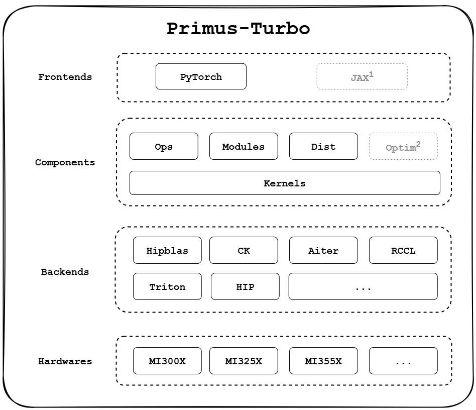

# Primus-Turbo
**Primus-Turbo** is a high-performance acceleration library dedicated to large-scale model training on AMD GPUs. Built and optimized for the AMD ROCm platform, it covers the full training stack — including core compute operators (GEMM, Attention, GroupedGEMM), communication primitives, optimizer modules, low-precision computation (FP8), and compute–communication overlap kernels.

With **High Performance**, **Full-Featured**, and **Developer-Friendly** as its guiding principles, Primus-Turbo is designed to fully unleash the potential of AMD GPUs for large-scale training workloads, offering a robust and complete acceleration foundation for next-generation AI systems.

<p align="center">
  
</p>
Note: JAX and Optim support are planned but not yet available.

## 🚀 What's New
- **[2025/9/19]** [Primus-Turbo introduction blog.](https://rocm.blogs.amd.com/software-tools-optimization/primus-large-models/README.html)
- **[2025/9/11]** Primus-Turbo initial release, version v0.1.0.


## 📦 Quick Start

### 1. Dependencies
#### Software
- ROCm >= 6.4
- Python >= 3.10
- PyTorch >= 2.6.0 (with ROCm support)
- rocSHMEM (optional, required for **experimental DeepEP**). Please refer to our [DeepEP Installation Guide](primus_turbo/pytorch/deep_ep/README.md) for instructions.


#### Hardware
- AMD Instinct GPUs
- GFX942: MI300X, MI325X
- GFX950: MI350X, MI355X

### 2. Docker (Recommended)
Use the pre-built AMD ROCm image:
```
rocm/megatron-lm:v25.7_py310
```

### 3. Install from Source
#### Clone Repository
```
git clone https://github.com/AMD-AGI/Primus-Turbo.git --recursive
cd Primus-Turbo
```

#### User Install
```
pip3 install -r requirements.txt
pip3 install --no-build-isolation .
```

#### Developer Install (editable mode)
```
pip3 install -r requirements.txt
pip3 install --no-build-isolation -e . -v
```

### 4. Build & Deploy Wheel
```
pip3 install -r requirements.txt
python3 -m build --wheel --no-isolation
pip3 install --extra-index-url https://test.pypi.org/simple ./dist/primus_turbo-XXX.whl
```

### 5. Minimal Example
```python
import torch
import primus_turbo.pytorch as turbo

dtype = torch.bfloat16
device = "cuda:0"

a = torch.randn((128, 256), dtype=dtype, device=device)
b = torch.randn((256, 512), dtype=dtype, device=device)
c = turbo.ops.gemm(a, b)

print(c)
print(c.shape)
```

## 💡 Example
See [Examples](./docs/examples.md) for usage examples.


## 📊 Performance
See [Benchmarks](./benchmark/README.md) for detailed performance results and comparisons.

## 📍Roadmap
[Roadmap: Primus-Turbo Roadmap H2 2025](https://github.com/AMD-AGI/Primus-Turbo/issues/101)

## 📜 License

Primus-Turbo is licensed under the MIT License.

© 2025 Advanced Micro Devices, Inc. All rights reserved.
